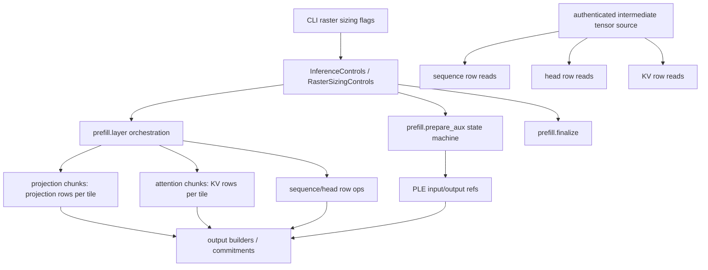

# Refactor Raster zkVM Sizing Controls

## Overview

Raster projection now has an explicit `--raster-projection-rows-per-tile` control that bounds how many projection weight rows a recursive projection tile reads and computes. That is the right pattern, but it only covers one family of prefill work.

This plan defines the next work needed to make the full raster prefill path tunable by explicit zkVM sizing controls. The goal is that each expensive tile family has a clear bound over the data it reads, the compute it performs, and the state it carries across tile invocations.

---

## Problem Frame

The current raster path can run with `--raster-projection-rows-per-tile 25`, which targets roughly 1 MiB of weight-row input for the worst-case Gemma text FFN down projection:

```text
rows_per_tile = floor(1 MiB / (4 bytes * input_width))
              = floor(1,048,576 / (4 * 10,240))
              = 25
```

That makes projection tile weight reads explicit. It does not prove that every tile in raster prefill is zkVM-feasible:

- The intermediate row store is currently an in-memory value that is threaded through tile calls. If a real zkVM boundary serializes the whole store, refs do not bound state.
- `prefill_prepare_aux` still carries materialized activation sequences and accumulated per-layer inputs in recursive state.
- Attention row tiles are one query row at a time, but each tile can read the full visible key/value window for that query. This is small for short prompts and risky for long prompts.
- Some orchestration boundaries still materialize full tensors to preserve public/checkpoint behavior.

This plan turns those observations into a sequence of implementation-ready work items.

---

## Requirements Trace

- R1. Provide explicit sizing controls for every prefill tile family whose per-invocation work can grow with model width, prompt length, layer count, head count, or attention window.
- R2. Preserve deterministic raster parity with the existing raster path for the same prompt/model/control inputs.
- R3. Preserve existing public checkpoint payloads and commitments unless a later plan explicitly introduces a versioned checkpoint format change.
- R4. Ensure tile invocation state is bounded by refs, cursors, and compact metadata, not by full intermediate tensors.
- R5. Keep `--raster-projection-rows-per-tile` semantics unchanged while adding additional controls.
- R6. Keep raster controls practical for both native debugging and zkVM sizing experiments.

---

## Scope Boundaries

- In scope: additional raster sizing controls, intermediate row-store contract changes, PLE prepare-aux state refactoring, attention KV-window chunking, prefill orchestration ref threading, and bounded materialization planning.
- In scope: focused tests that prove the new controls change chunking without changing deterministic output.
- Out of scope: changing native fp32 inference or non-raster deterministic inference.
- Out of scope: changing model weight file formats or deterministic `.detwgt` tensor layout.
- Out of scope: introducing a new public checkpoint format in this plan.
- Out of scope: proving exact RISC Zero cycle limits before implementation. This plan creates the control surface and measurement hooks needed to tune those limits.

### Deferred to Follow-Up Work

- Versioned checkpoint payloads that commit refs instead of full materialized values should be handled separately if checkpoint payload size becomes the limiting factor.
- Actual RISC Zero proving benchmarks should follow after each major tile-family control is implemented.

---

## Context & Research

### Relevant Code and Patterns

- `src/lib.rs` owns `InferenceControls` and the default `raster_projection_rows_per_tile`.
- `src/main.rs` parses `--raster-projection-rows-per-tile`.
- `src/dsl.rs` records tile/sequence invocations through DSL macros.
- `src/shared/raster_row_store.rs` defines typed refs, row requests, builders, and the in-memory store.
- `src/shared/raster_transformer_kernels.rs` contains the reference-backed row kernels and projection chunk loop.
- `src/prefill_layer/raster_tiles.rs` orchestrates raster prefill layer execution and projection calls.
- `src/prefill_prepare_aux/raster_tiles.rs` still carries materialized PLE recursive state.
- `src/prefill_finalize/raster_tiles.rs` is a useful existing pattern for bounded final logits projection.
- `RASTER_ZKVM_STATE_REFACTOR_ROADMAP.md` defines the reference-carrying state direction.
- `RASTER_INTERMEDIATE_TENSOR_REFS_DESIGN.md` defines the current intermediate tensor reference contract.
- `RASTER_PREFILL_ZKVM_REFACTOR_GUIDE.md` records the earlier prefill decomposition strategy.

### External References

- RISC Zero supports long executions through continuations, so the relevant control target is not a universal max execution length. The practical limits are per-segment cycles, proving memory, input/read volume, page behavior, and total proving time.

---

## Key Technical Decisions

- Add separate controls per tile family instead of overloading `projection_rows_per_tile`. Projection rows, attention KV rows, sequence rows, and materialization rows have different scaling behavior.
- Treat projection's formula as the model for future controls: each knob should bound a specific data axis and expose a simple estimate for bytes/read or rows/tile.
- Make the row store contract explicit before relying on refs for zkVM sizing. Passing a value-backed store through tile calls is not the same as passing a small authenticated source handle.
- Prioritize PLE prepare-aux and attention before optional row batching. PLE still carries value state, and attention is the main prompt-length risk.
- Keep one-row defaults for simple row ops until measurement shows tile count is the bottleneck. These operations are already bounded by row width, not matrix rows.

---

## Proposed Controls

| Control | Primary bound | Applies to | Initial default |
|---|---:|---|---:|
| `--raster-projection-rows-per-tile` | projection weight rows | sequence projections and logits projection | existing default `1` |
| `--raster-attention-kv-rows-per-tile` | visible key/value or score/weight rows per attention step | attention score collection, softmax passes, and weighted-sum work | conservative default `32` |
| `--raster-sequence-rows-per-tile` | activation sequence rows | RMSNorm, GELU, scale, add, mul | optional; default `1` |
| `--raster-head-rows-per-tile` | head/token rows | head RMSNorm, value norm, RoPE, reshape, combine, KV build | optional; default `1` |
| `--raster-materialize-rows-per-tile` | rows materialized per tile | finalization/checkpoint materialization if needed | optional; no behavior until materialization is chunked |

The implementation should not add all flags before the corresponding code respects them. Each flag should land with at least one tile family whose behavior it actually controls.

---

## High-Level Technical Design

> *This illustrates the intended approach and is directional guidance for review, not implementation specification. The implementing agent should treat it as context, not code to reproduce.*



---

## Phased Delivery

Implement this plan one phase at a time. Each phase should leave the raster path compiling, tested, and usable for the next phase. Do not start a later phase until the previous phase's verification has passed, unless a phase explicitly says it can run independently.

### Phase 1: Establish honest sizing boundaries

**Units:** U2, then the minimal parts of U1 needed to pass structured sizing controls internally.

**Goal:** Make it clear what actually crosses tile boundaries before adding more public knobs. If the row store is still serialized wholesale, refs do not yet provide zkVM-sized state even when recursive states look compact.

**Implementation guidance:**
- Start with U2.
- Add only internal control structuring from U1 if it makes U2 cleaner.
- Do not add new public CLI flags in this phase unless the implementation also consumes them.

**Exit criteria:**
- The row-store contract has a documented and tested separation between compact refs/cursors and the value-backed local store.
- Existing raster projection and row-store tests pass.
- A developer can explain whether the future zkVM tile boundary contains the full store or only an authenticated row-source handle.

### Phase 2: Fix the prepare-aux state-size gap

**Units:** U3.

**Goal:** Remove the remaining materialized PLE activation and per-layer input tensors from recursive prepare-aux state.

**Implementation guidance:**
- Keep public `Gemma4PrefillPleInputs` materialization at finalize boundaries.
- Preserve existing prepare-aux checkpoint behavior.
- Continue using the existing projection chunking control for PLE projection.

**Exit criteria:**
- `PrefillPleRasterState` serializes refs, cursors, metadata, token IDs, and compact control values rather than full activation row data.
- Existing PLE raster parity tests pass.

### Phase 3: Add progress visibility before deeper chunking

**Units:** U8, limited to progress reporting for existing projection and layer/prepare-aux progress.

**Goal:** Make long raster runs observable before adding more complex attention chunking. This phase should not change computation or checkpoint commitments.

**Implementation guidance:**
- Keep progress logs separate from `trace_checkpoint`.
- Stop treating `prefill.layer_token.*` output as progress. If retained, gate it behind verbose tracing or leave it only as a terminal-checkpoint compatibility detail.
- Add time-throttled or coarse progress logs for `prefill.prepare_aux`, `prefill.layer`, and long projection substeps.

**Exit criteria:**
- Long runs show progress during `transformer_state_transition`.
- Checkpoint bundle contents and semantic checkpoint IDs remain unchanged.
- Progress logging can be enabled or observed without adding high-volume per-token terminal noise.

### Phase 4: Bound attention by KV-window chunks

**Units:** U4 plus the public/control pieces of U1 needed for `--raster-attention-kv-rows-per-tile`.

**Goal:** Add the attention equivalent of projection chunking: a knob that bounds visible key/value rows and per-query softmax score/weight rows consumed per tile invocation.

**Implementation guidance:**
- Preserve attention arithmetic exactly. Treat softmax/reduction ordering as the main correctness risk.
- Split softmax into explicit bounded phases over committed score/weight refs rather than forcing a clever one-pass algorithm.
- Add the CLI flag only when attention actually honors it.

**Exit criteria:**
- Attention outputs match current behavior for chunk size `1`, small values, and oversized values.
- For a given query tile, key/value row reads and softmax score/weight row reads are bounded by `raster_attention_kv_rows_per_tile`.
- Existing prefill-layer parity tests pass.

### Phase 5: Thread refs through full prefill orchestration

**Units:** U5.

**Goal:** Reduce internal full-tensor materialization between prefill layer substeps so the layer body becomes mostly ref-to-ref transformations.

**Implementation guidance:**
- Split implementation by block if needed: attention block, MLP block, PLE block.
- Keep `prefill.layer` checkpoint materialization explicit and localized.
- Do not mix this phase with attention arithmetic changes from Phase 4.

**Exit criteria:**
- Expensive prefill substeps can be described as ref-to-ref transformations.
- Recursive layer state does not carry full current activations, donor cache values, or per-layer input rows.
- Layer checkpoint commitments remain stable.

### Phase 6: Add optional batching controls for simple row ops

**Units:** U6.

**Goal:** Add performance tuning controls for simple sequence/head row operations once state boundaries are already honest and attention is bounded.

**Implementation guidance:**
- Keep defaults conservative.
- Treat this as tile-count tuning, not the primary zkVM feasibility work.
- Do not use these controls to replace attention KV-window chunking.

**Exit criteria:**
- Sequence and head row ops match current output for chunk sizes `1`, small values, and oversized values.
- Tile invocation counts decrease when batching is enabled, while output commitments stay stable.

### Phase 7: Resolve materialization/checkpoint boundaries

**Units:** U7, plus any remaining U8 sizing estimates.

**Goal:** Decide which full materialization boundaries are acceptable compatibility points and which need chunking or future versioned checkpoint work.

**Implementation guidance:**
- Inventory before refactoring.
- Keep checkpoint compatibility unless a new versioned trace plan explicitly changes it.
- Record recommended model-specific sizing values after measurement.

**Exit criteria:**
- The repo documents every remaining full materialization boundary and its decision.
- Any remaining `raster_materialize_rows_per_tile` work is either implemented or explicitly deferred.
- Progress output, checkpoint output, and sizing estimates are aligned with the final control surface.

---

## Implementation Units

- [ ] U1. **Define raster sizing controls**

**Goal:** Replace the single optional projection control plumbing with a structured raster sizing control surface that can hold projection, attention, sequence, head, and materialization chunk sizes.

**Requirements:** R1, R5, R6

**Dependencies:** None

**Files:**
- Modify: `src/lib.rs`
- Modify: `src/main.rs`
- Modify: `src/prefill_layer/mod.rs`
- Modify: `src/prefill_prepare_aux/mod.rs`
- Modify: `src/prefill_finalize/mod.rs`
- Test: `src/main.rs`
- Test: `src/lib.rs`

**Approach:**
- Introduce a struct or equivalent grouping for raster sizing controls instead of threading independent optional values forever.
- Preserve `--raster-projection-rows-per-tile` and current default behavior.
- Add new fields only when they have an implementing unit ready to consume them, or add them as internal controls without CLI flags until use.
- Keep zero rejection behavior consistent across all chunk-size controls.

**Patterns to follow:**
- Existing `InferenceControls::raster_projection_rows_per_tile` in `src/lib.rs`.
- Existing CLI parsing for `--raster-projection-rows-per-tile` in `src/main.rs`.

**Test scenarios:**
- Happy path: parsing `--raster-projection-rows-per-tile 25` still yields `projection_rows_per_tile = 25`.
- Error path: each implemented control rejects zero.
- Error path: raster sizing flags still require `--raster`.
- Integration: raster inference receives the same projection chunk value as before when only the existing flag is passed.

**Verification:**
- Existing projection chunk-size tests still pass.
- CLI behavior remains backward-compatible for current commands.

---

- [x] U2. **Make the intermediate row store a zkVM-sized contract**

**Goal:** Separate the logical authenticated row-source contract from the current in-memory store so refs actually bound tile arguments and state.

**Requirements:** R2, R3, R4

**Dependencies:** U1 is helpful but not required

**Files:**
- Modify: `src/shared/raster_row_store.rs`
- Modify: `src/shared/raster_transformer_kernels.rs`
- Modify: `src/prefill_layer/raster_tiles.rs`
- Modify: `src/prefill_prepare_aux/raster_tiles.rs`
- Test: `src/shared/raster_row_store.rs`
- Test: `src/shared/raster_transformer_kernels.rs`

**Approach:**
- Clarify which data crosses a tile boundary in the future zkVM replay model: refs/cursors/control values should cross; full tensor maps should not.
- Introduce a trait or typed handle layer for row reads if needed, while keeping the current in-memory implementation for local execution and tests.
- Ensure every row read still validates kind, shape, row index, and commitment.
- Avoid changing public checkpoint payloads. Materialize at checkpoint boundaries as compatibility behavior.

**Patterns to follow:**
- `RasterSequenceRowRequest`, `RasterHeadRowRequest`, and `RasterKvRowRequest` in `src/shared/raster_row_store.rs`.
- Reference-backed states in `src/shared/raster_transformer_kernels.rs`.
- `RASTER_INTERMEDIATE_TENSOR_REFS_DESIGN.md`.

**Test scenarios:**
- Happy path: valid sequence/head/KV row requests return the same rows through the new contract and the current store implementation.
- Error path: bad ref IDs, wrong tensor kinds, bad shapes, and out-of-range row indexes fail closed.
- Integration: existing reference-backed sequence/projection/attention helpers still produce identical deterministic outputs.
- Regression: checkpoint commitments remain unchanged for existing test fixtures.

**Verification:**
- Implementers can point to the precise serialized tile boundary shape and show that it does not include the full in-memory tensor map.

---

- [x] U3. **Refactor PLE prepare-aux state to refs**

**Goal:** Remove materialized activation sequences and accumulated per-layer inputs from `PrefillPleRasterState` recursive state.

**Requirements:** R2, R4

**Dependencies:** U2

**Files:**
- Modify: `src/prefill_prepare_aux/raster_tiles.rs`
- Modify: `src/shared/raster_row_store.rs`
- Modify: `src/shared/raster_transformer_kernels.rs`
- Test: `src/prefill_prepare_aux/raster_tiles.rs`

**Approach:**
- Replace `input_activations: Option<RasterActivationSequence>` with an activation-sequence ref plus shape metadata.
- Replace `per_layer_inputs: Vec<Option<RasterActivationSequence>>` with refs, builder refs, or a compact per-layer input registry.
- Keep `finalize_prefill_ple_inputs` materializing the public `Gemma4PrefillPleInputs` shape for compatibility.
- Ensure PLE projection uses the existing projection chunking control and reads the input row through refs.

**Patterns to follow:**
- `RasterSequenceProjectionState` ref/cursor shape in `src/shared/raster_transformer_kernels.rs`.
- `PrefillLayerRasterState` use of `RasterActivationSequenceRef` in `src/prefill_layer/raster_tiles.rs`.

**Test scenarios:**
- Happy path: `chunked_prefill_ple_projection_matches_native_prefill_ple_computation` still passes.
- Happy path: mixed PLE/non-PLE layer fixtures still produce identical per-layer input presence and values.
- Error path: missing input ref or malformed activation shape fails closed.
- Serialization: `PrefillPleRasterState` no longer serializes full activation row data.

**Verification:**
- Recursive PLE state contains token IDs, refs, cursors, shape metadata, and compact control values only.

---

- [x] U4. **Add attention KV-window chunking**

**Goal:** Add `--raster-attention-kv-rows-per-tile` behavior so attention work can be bounded independently from prompt length.

**Requirements:** R1, R2, R4, R6

**Dependencies:** U2

**Files:**
- Modify: `src/shared/raster_transformer_kernels.rs`
- Modify: `src/prefill_layer/raster_tiles.rs`
- Modify: `src/lib.rs`
- Modify: `src/main.rs`
- Test: `src/shared/raster_transformer_kernels.rs`
- Test: `src/prefill_layer/raster_tiles.rs`
- Test: `src/main.rs`

**Approach:**
- Extend attention state with a cursor over the visible KV window for the current `(query_head_idx, query_token_idx)`.
- Accumulate enough deterministic intermediate state to combine chunked attention scores, softmax weights, and values without changing arithmetic semantics.
- Preserve grouped KV mapping and donor-cache behavior.
- Start conservative: one query row remains the outer unit; KV-window chunks become the inner unit.
- Split exact softmax into bounded max, exponent-sum, raw-weight, residual-correction, and weighted-sum phases over committed intermediate refs.

**Patterns to follow:**
- `compute_next_attention_row` in `src/shared/raster_transformer_kernels.rs`.
- Existing attention parity tests for full, sliding-window, and donor-cache attention.

**Test scenarios:**
- Happy path: full attention with `kv_rows_per_tile = 1`, `2`, and oversized values matches current `causal_attention_heads_with_cache`.
- Happy path: sliding-window attention respects the smaller of window size and chunk size.
- Happy path: donor-cache attention reads from cache refs and matches current donor-cache output.
- Edge case: first token with a one-row visible window works with any positive chunk size.
- Edge case: equal max logits across chunk boundaries preserve first-max residual correction.
- Error path: zero `kv_rows_per_tile` fails closed.
- Error path: malformed refs or mismatched query/key/value shapes fail closed.

**Verification:**
- For a given query tile invocation, key/value reads and softmax score/weight row passes are bounded by `raster_attention_kv_rows_per_tile`.

---

- [x] U5. **Thread refs through prefill layer orchestration**

**Goal:** Stop materializing full tensors between prefill substeps unless crossing a public/checkpoint boundary.

**Requirements:** R2, R3, R4

**Dependencies:** U2, U3, U4

**Files:**
- Modify: `src/prefill_layer/raster_tiles.rs`
- Modify: `src/shared/raster_transformer_kernels.rs`
- Modify: `src/shared/raster_row_store.rs`
- Test: `src/prefill_layer/raster_tiles.rs`
- Test: `src/shared/raster_transformer_kernels.rs`

**Approach:**
- Move layer substep helpers toward accepting and returning refs where possible.
- Keep materialized compatibility returns for public sequence wrappers until all callers can consume refs.
- Avoid converting every helper in one PR if doing so obscures parity risk. Prefer one block at a time: attention block, MLP block, PLE block.
- Keep `prefill.layer` checkpoint materialization explicit and localized.

**Patterns to follow:**
- Existing `PrefillLayerRasterState` ref usage for `current_activations_ref`.
- Sequence/head/KV builder finalization patterns in `src/shared/raster_row_store.rs`.

**Test scenarios:**
- Integration: one-layer prefill parity remains unchanged with and without PLE input.
- Integration: multi-layer prefill parity remains unchanged, including shared KV donor layers.
- Serialization: recursive layer state does not include full current activations, donor cache values, or per-layer input rows.
- Regression: `prefill.layer` checkpoint commitments remain stable.

**Verification:**
- Expensive substeps can be traced as ref-to-ref transformations rather than materialize-transform-reinsert loops.

---

- [x] U6. **Add optional sequence/head row batching controls**

**Goal:** Provide tuning knobs for tile count once state is bounded, without making simple row ops the limiting zkVM input size.

**Requirements:** R1, R2, R6

**Dependencies:** U1, U2

**Files:**
- Modify: `src/shared/raster_transformer_kernels.rs`
- Modify: `src/prefill_layer/raster_tiles.rs`
- Modify: `src/lib.rs`
- Modify: `src/main.rs`
- Test: `src/shared/raster_transformer_kernels.rs`
- Test: `src/prefill_layer/raster_tiles.rs`
- Test: `src/main.rs`

**Approach:**
- Add `raster_sequence_rows_per_tile` only for row ops where batching preserves simple deterministic semantics.
- Add `raster_head_rows_per_tile` for head/token operations where batching is just repeated independent rows.
- Keep default `1` unless measurements prove a different default is safe.
- Do not use these knobs for attention KV-window chunking; attention gets its own control because its semantics are not independent row batching.

**Patterns to follow:**
- Existing one-row recursive states for sequence unary/binary, head unary, reshape, combine, and KV cache build.

**Test scenarios:**
- Happy path: sequence unary/binary outputs match for chunk size `1`, `2`, and oversized.
- Happy path: head ops outputs match for chunk size `1`, `2`, and oversized.
- Error path: zero chunk sizes fail closed.
- Integration: tile invocation counts decrease when larger row batching is used, while output commitments stay unchanged.

**Verification:**
- Each batched tile's data size is bounded by `rows_per_tile * row_width` or `rows_per_tile * head_dim`.

---

- [x] U7. **Plan bounded materialization and checkpoint behavior**

**Goal:** Decide where full materialization is still acceptable and where it needs chunked materialization or versioned checkpoint handling.

**Requirements:** R3, R4

**Dependencies:** U2, U5

**Files:**
- Modify: `src/trace.rs`
- Modify: `src/prefill_layer/raster_tiles.rs`
- Modify: `src/prefill_prepare_aux/raster_tiles.rs`
- Modify: `src/prefill_finalize/raster_tiles.rs`
- Test: `src/trace.rs`
- Test: `src/prefill_layer/raster_tiles.rs`

**Approach:**
- Inventory every place that materializes a full sequence, heads tensor, KV cache, or checkpoint payload.
- Classify each materialization as public output, compatibility checkpoint, internal convenience, or avoidable.
- Add `raster_materialize_rows_per_tile` only if a materialization site must become chunked for zkVM replay.
- Keep `prefill.layer_token.*` terminal noise separate from durable checkpoints. Progress logging should not masquerade as checkpointing.

**Patterns to follow:**
- `should_commit_checkpoint` in `src/trace.rs`.
- `prefill.layer` checkpoint creation in `src/prefill_layer/raster_tiles.rs`.

**Test scenarios:**
- Regression: committed checkpoint bundle still excludes `prefill.layer_token.*`.
- Regression: `prefill.layer` and `prefill.finalize` commitments remain stable unless a versioned change is explicitly introduced.
- Integration: terminal checkpoint pausing still works for semantic checkpoint IDs.
- Edge case: materialization of an incomplete builder fails closed.

**Verification:**
- The repo has a documented list of remaining full materialization boundaries and a decision for each.

---

- [ ] U8. **Add sizing estimates and progress reporting**

**Goal:** Make sizing choices observable so users can tune controls without guessing from long silent runs.

**Requirements:** R1, R6

**Dependencies:** U1, U4

**Files:**
- Modify: `src/trace.rs`
- Modify: `src/prefill_layer/raster_tiles.rs`
- Modify: `src/prefill_prepare_aux/raster_tiles.rs`
- Modify: `src/lib.rs`
- Test: `src/trace.rs`
- Test: `src/prefill_layer/raster_tiles.rs`

**Approach:**
- Add progress logs separate from checkpoints, such as `prefill.prepare_aux layer i/n`, `prefill.layer i/n`, and long projection/attention substep progress.
- Throttle progress by elapsed time or coarse chunk counts rather than printing every row/token.
- Optionally include estimated per-tile bytes for projection and attention based on model dimensions and chunk sizes.
- Keep durable checkpoint output focused on semantic checkpoints.

**Patterns to follow:**
- Existing `raster_tile_invocations_finished` and phase logs in `src/trace.rs`.
- Existing trace scope labels in `src/prefill_layer/raster_tiles.rs`.

**Test scenarios:**
- Happy path: progress logging can be enabled without changing checkpoint bundle contents.
- Happy path: long projection progress reports matrix kind, token progress, and projection-row progress.
- Happy path: attention progress reports layer/head/token and KV-window chunk progress.
- Regression: semantic checkpoint IDs remain unchanged.

**Verification:**
- A run with larger chunk sizes shows meaningful live progress during `transformer_state_transition`, not only checkpoint bursts after work completes.

---

## System-Wide Impact

- **Interaction graph:** CLI controls flow through `InferenceControls`, prefill prepare-aux, prefill layer, finalize, and shared raster kernels.
- **Error propagation:** New chunk controls should fail early in CLI/control validation when possible and fail closed inside tile init when invalid state reaches lower layers.
- **State lifecycle risks:** Ref-backed builders can leave partial outputs. Finalizers must reject missing rows, duplicate/skipped rows, wrong widths, and incomplete chunks.
- **API surface parity:** Native fp32 and deterministic non-raster paths should remain unchanged. Raster public outputs should remain `ActivationSequence`, `LayerKvCache`, and existing checkpoint summary shapes.
- **Integration coverage:** Unit tests for individual kernels are not enough. Each major refactor needs prefill-layer and prepare-aux parity coverage.
- **Unchanged invariants:** Deterministic arithmetic, model weight reads, checkpoint commitments, and tile/sequence DSL rules remain stable unless explicitly changed in a follow-up plan.

---

## Risks & Dependencies

| Risk | Mitigation |
|------|------------|
| Treating an in-memory store as a zkVM-sized ref source when it is actually serialized wholesale | Make the row-store boundary explicit before claiming state-size wins |
| Chunked attention changes softmax arithmetic ordering | Add parity tests for full, sliding-window, and donor-cache attention across chunk sizes |
| Too many controls make the CLI hard to use | Add controls only when implemented and document recommended defaults/formulas |
| Checkpoint compatibility hides large materialization costs | Inventory materialization sites and separate progress logs from checkpoints |
| Larger chunks reduce tile count but increase per-tile proving cost | Report both invocation counts and estimated per-tile bytes/work |
| Ref-threading refactors become too broad | Split by block: PLE prepare-aux, attention, MLP/sequence ops, materialization |

---

## Suggested Sizing Rules

Projection:

```text
rows_per_tile = floor(target_weight_bytes / (4 * projection_input_width))
```

For Gemma 4 E4B text with a 1 MiB target:

```text
hidden-width projections: input_width = 2,560 -> rows_per_tile ~= 102
down projection:          input_width = 10,240 -> rows_per_tile = 25
safe single value:        projection_rows_per_tile = 25
```

Attention KV-window chunks:

```text
kv_rows_per_tile ~= floor(target_attention_bytes / (2 * 4 * head_dim))
```

The factor of `2` covers key and value rows. This ignores temporary logits/weights and row-store overhead, so implementations should choose conservative defaults and validate with measurement.

Sequence/head row batching:

```text
sequence_bytes_per_tile ~= rows_per_tile * width * 4
head_bytes_per_tile     ~= rows_per_tile * head_dim * 4
```

These should remain conservative because they are performance knobs, not the main feasibility blocker.

---

## Phase 7 Materialization Boundary Inventory

Phase 7 keeps the public checkpoint format unchanged and documents the remaining full materialization boundaries instead of adding `raster_materialize_rows_per_tile` without a versioned checkpoint change.

| Boundary | Location | Classification | Decision |
|---|---|---|---|
| PLE public inputs | `src/prefill_prepare_aux/raster_tiles.rs` `finalize_prefill_ple_inputs` | Public compatibility output | Materialize from refs into `Gemma4PrefillPleInputs` at finalize only. Recursive PLE state remains ref-backed. |
| Prefill layer current activations | `src/prefill_layer/raster_tiles.rs` `compute_next_prefill_layer_sequence` | Internal compatibility bridge | Materialized per layer while `run_prefill_layer_sequence` still consumes value tensors. The recursive orchestration state stores refs before and after each layer. |
| Prefill layer PLE inputs | `src/prefill_layer/raster_tiles.rs` `compute_next_prefill_layer_sequence` | Internal compatibility bridge | Materialized only when entering the value-based layer sequence. Source state stores per-layer input refs. |
| Donor/cache inputs | `src/prefill_layer/raster_tiles.rs` `materialize_prefill_layer_cache_from_store` | Internal compatibility bridge and checkpoint source | Empty caches stay compact; non-empty caches materialize when the current layer needs donor values or checkpoint serialization needs public cache shape. |
| Prefill layer checkpoint payload | `src/prefill_layer/raster_tiles.rs` `finalize_prefill_layer_state` | Durable checkpoint compatibility | Keep existing f32/deterministic commitment payload shape. Do not serialize refs into checkpoint bundles without a versioned trace format. |
| Terminal token checkpoints | `src/prefill_layer/raster_tiles.rs` `finalize_prefill_layer_state`; filter in `src/trace.rs` | Terminal checkpoint / verbose observability | Continue excluding `prefill.layer_token.*` from committed checkpoint bundles. Emit/check terminal hits only when verbose tracing or a matching terminal checkpoint observes them. |
| Prefill finalize inputs and logits | `src/prefill_finalize/raster_tiles.rs` | Public compatibility output | Keep materializing final hidden state and logits projection output for the existing `prefill.finalize` payload and return type. Projection reads remain chunked by `raster_projection_rows_per_tile`. |
| Row-store builder finalization | `src/shared/raster_row_store.rs` | Internal ref boundary | Builders reject incomplete/skipped/duplicate rows and materialize only when a public output or compatibility bridge requests it. No separate materialization chunk control is needed for Phase 7. |

Deferred decision: implement `raster_materialize_rows_per_tile` only if a future versioned checkpoint plan changes durable checkpoint payloads to commit refs or chunked materialization products. The current compatibility checkpoints intentionally remain full materialization boundaries.

---

## Documentation / Operational Notes

- Update `RASTER_PREFILL_ZKVM_REFACTOR_GUIDE.md` after implementing each major work item so the guide stays current.
- Add CLI help text for each new public control at the same time the control becomes functional.
- Record recommended values for Gemma 4 E4B after the first measurement pass.
- Keep long-running progress output separate from committed checkpoint traces.

---

## Sources & References

- Related roadmap: `RASTER_ZKVM_STATE_REFACTOR_ROADMAP.md`
- Related design: `RASTER_INTERMEDIATE_TENSOR_REFS_DESIGN.md`
- Related guide: `RASTER_PREFILL_ZKVM_REFACTOR_GUIDE.md`
- Projection implementation: `src/shared/raster_transformer_kernels.rs`
- Row store implementation: `src/shared/raster_row_store.rs`
- Prefill layer orchestration: `src/prefill_layer/raster_tiles.rs`
- PLE prepare-aux orchestration: `src/prefill_prepare_aux/raster_tiles.rs`
